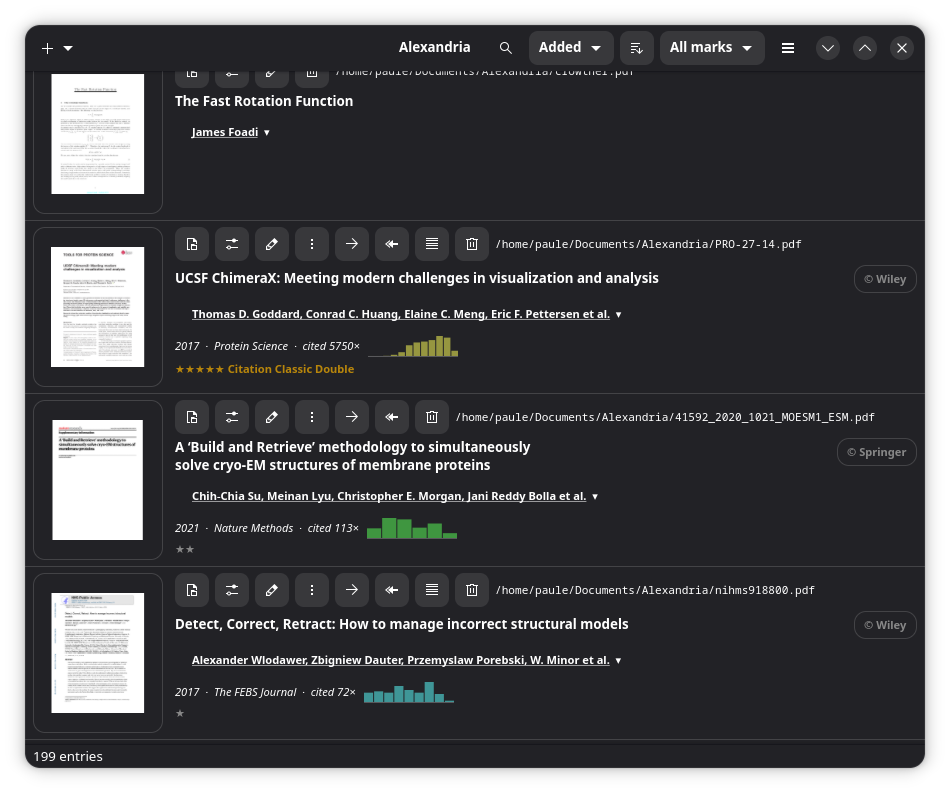

# Alexandria

A GTK4-based organizer/reference manager for scientific PDFs.

Alexandria is designed to be a personal and local store. It is not
an interface where you upload your document collection to a cloud
server somewhere. You pdf catalogue won't be (can't be) part of
someone else's data harvesting. There is no crowdsourcing.
If you want your reading habits and project lists tracked by
corporations, and suggested to others then Alexandria is not
for you.

Alexandria has 3 main "views"
  - PDF viewer: for reading and annotations
  - PDF organizer/reference manager: view, store and update metadata
  - Author view: what's been published (recently), who publishes
    with or cites who?

There is a pdf viewer, based on poppler [1] built-in. One can add
annotations to pdfs.

Alexandria uses OpenAlex and CrossRef network calls and pdf text
extraction to associate metadata [2] with pdf files (`.alexandria`
extension, but JSON inside) - these are the "sidecars."

It would not be very wrong to describe Alexandria as a desktop
interface to OpenAlex that knows about pdf files and citation
formats.

The file store is a plain old directory with pdf files in it.

An SQLite database is constructed using the sidecars for fast
searching.

There are subscriptions and discovery.

Alexandria uses JATS where it can.

Alexandria is intended to be XDG Base Directory Protocol [3] compliant. It
writes, by default, to `$HOME/Documents/Alexandria` and the database to
`$HOME/.local/state/Alexandria` with a config file
in `$HOME/.config/Alexandria/config.json` for sort order config and
OpenAlex key.

## Screenshot

## Install

    apt install python3-gi gir1.2-gtk-4.0 gir1.2-poppler-0.18 poppler-utils
    make install

## Usage

  Upon opening Alexandria, it will detect pdfs files in
  `$HOME/Documents/Alexandria` and try to create a thumbnail png and the
  associated metadata (if they don't already exist).

## Notes
- [1] poppler `https://poppler.freedesktop.org/`
- [2] titles, authors, journal, year, DOI, comments
- [3] `https://specifications.freedesktop.org/basedir/latest/`

