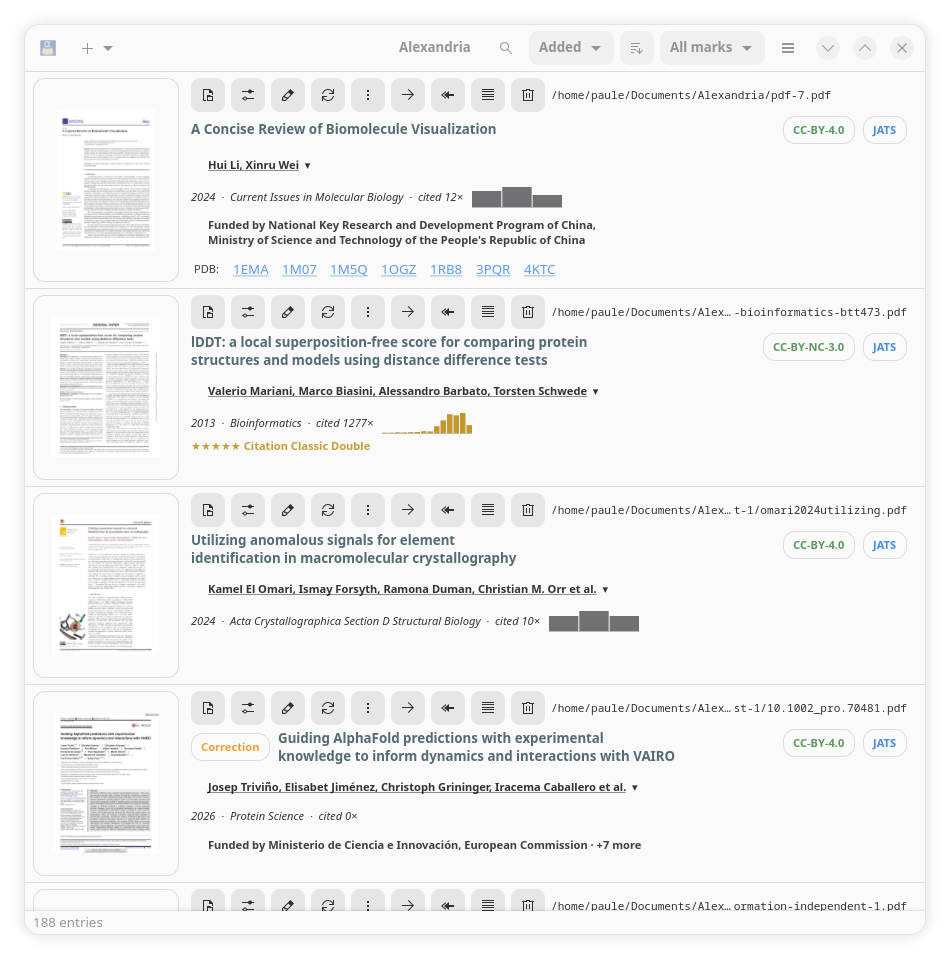
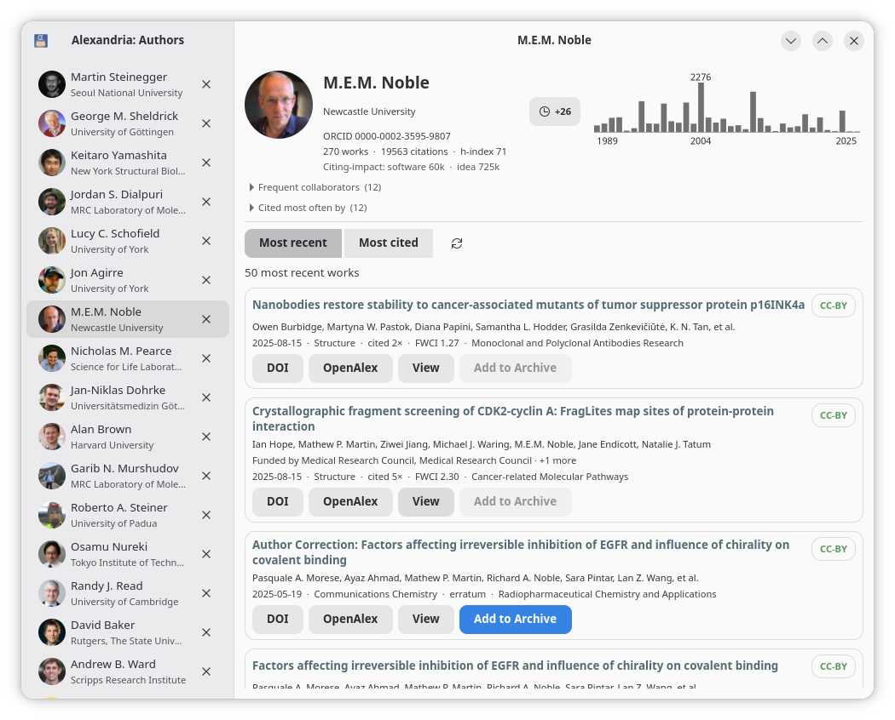

# Alexandria

A GTK4-based organizer/reference manager for scientific PDFs.

Alexandria is designed to be a personal and local store. It is not
an interface where you upload your document collection to a cloud
server somewhere. You PDF catalogue won't be (can't be) part of
someone else's data harvesting. There is no crowdsourcing.
If you want your reading habits and project lists tracked by
corporations, and suggested to others then Alexandria is not
for you.

Alexandria has 3 main "views"
  - PDF viewer: for reading and annotations
  - PDF organizer/reference manager: view, store and update metadata
  - Author view: what's been published (recently), who publishes
    with or cites who?

There is a PDF viewer, based on poppler [1] built-in. One can add
annotations to PDFs.

Alexandria uses OpenAlex and CrossRef network calls and PDF text
extraction to associate metadata [2] with PDF files (`.alexandria`
extension, but JSON inside) - these are the "sidecars."

It would not be very wrong to describe Alexandria as a desktop
interface to OpenAlex that knows about PDF files and citation
formats.

The file store is a plain old directory with PDF files in it.

An SQLite database is constructed using the sidecars for fast
searching.

There are subscriptions and discovery.

Alexandria uses JATS where it can.

Alexandria is intended to be XDG Base Directory Protocol [3] compliant. It
writes, by default, to `$HOME/Documents/Alexandria` and the database to
`$HOME/.local/state/Alexandria` with a config file
in `$HOME/.config/Alexandria/config.json` for sort order config and
OpenAlex key.

## > [!CAUTION]
> If you cloned Alexandria before 0.5.0 then it's probably best
to throw away the previous repo and start fresh.
>
> I rewrote the history and removed and recreated the repo to remove
> information that should not have been there.

## Screenshots

## Install

### Debian / Ubuntu

    apt install python3-gi gir1.2-gtk-4.0 gir1.2-poppler-0.18 poppler-utils
    make install

### Arch Linux

The GTK stack and PyGObject come from pacman — PyGObject has to be
built against the same GTK it will load, so mixing a pip-installed
one with the system libraries is the way to a segfault:

    sudo pacman -S --needed gtk4 libadwaita poppler poppler-glib \
                            python-gobject python-cairo \
                            adwaita-icon-theme librsvg vte4

`poppler-glib` carries the `Poppler-0.18` typelib the viewer imports;
`poppler` provides `pdftotext`, which the text extraction shells out
to. `adwaita-icon-theme` and `librsvg` are what make the toolbar
render as icons rather than broken-image squares. `vte4` is only for
the optional built-in terminal.

The Python dependencies come from pip, and cannot come from pacman:
Arch ships `python-bibtexparser` 1.4.4, while `bibtex.py` uses the
v2 `parse_string` / middlewares API, and `pdfx` and `citeproc-py` are
not in the repositories at all.

Arch also marks its system Python as externally managed (PEP 668), so
`pip install --user` refuses to run. Use a virtualenv that can still
see pacman's PyGObject:

    python -m venv --system-site-packages ~/.venvs/alexandria
    make install PYTHON=~/.venvs/alexandria/bin/python

`--system-site-packages` is the load-bearing flag: without it the
venv cannot see `gi` at all, and pip will try to build PyGObject from
source to fill the gap. With it, pip installs only the pure-Python
dependencies and leaves the GTK bindings to pacman.

Then run `~/.venvs/alexandria/bin/alexandria-browse`, or put
`~/.venvs/alexandria/bin` on your `PATH`. The `.desktop` file
`make install` writes calls `alexandria-browse`, so either the venv's
`bin` needs to be on the PATH your desktop session sees, or edit the
`Exec=` line to the absolute path.

To run from the source tree instead, no install is needed once the
pacman packages above are present and the pip dependencies are in
the venv:

    ~/.venvs/alexandria/bin/python alexandria-browse.py

### macOS (Homebrew)

Alexandria is a GTK4 application, so the GTK stack and its
GObject-introspection typelibs have to come from Homebrew — there is
no wheel for them.

    brew install gtk4 libadwaita poppler gobject-introspection \
                 librsvg vte3 adwaita-icon-theme
    brew install pygobject3 py3cairo

    pip install --user .          # or: make install

Use the same Python throughout. Homebrew's `pygobject3` and
`py3cairo` are built for Homebrew's Python, so `pip install` with
that interpreter. If you would rather use your own Python, skip
those two formulae and let pip build PyGObject and pycairo from
source — that works, but only because the Homebrew C libraries
above are already present for it to compile against.

`adwaita-icon-theme` is not optional. Without it GTK falls back to its
small built-in icon set and much of the toolbar renders as
broken-image squares. `librsvg` is what draws SVG icons at all, and
`vte3` provides the optional built-in terminal.

To run from the source tree:

    export XDG_DATA_DIRS=/opt/homebrew/share
    export DYLD_LIBRARY_PATH=/opt/homebrew/lib
    python3 alexandria-browse.py

Both variables are needed because Homebrew installs outside the paths
GLib searches by default. `XDG_DATA_DIRS` in particular is not
optional: without it `Gtk.FileDialog` aborts with "No GSettings
schemas are installed on the system" the first time you open a file.

Or build a `.app` bundle, which gives Alexandria its own Dock icon and
identity instead of inheriting Python's:

    ./make-app.sh          # produces dist/Alexandria.app

Note that `make install` also installs a `.desktop` file and an XDG
icon, which do nothing on macOS but are harmless.

## Usage

  Upon opening Alexandria, it will detect PDF files in
  `$HOME/Documents/Alexandria` and try to create a thumbnail PNG and the
  associated metadata (if they don't already exist).

## Notes
- [1] poppler `https://poppler.freedesktop.org/`
- [2] titles, authors, journal, year, DOI, comments
- [3] `https://specifications.freedesktop.org/basedir/latest/`

